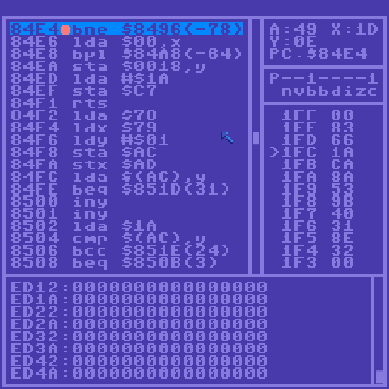

### Another 6502

Another 6502 implementation in Javascript. I wanted to create a new game, I ended up with another emulator... :confused:



Run it with docker:
```
docker-compose up
```

or manually
```
yarn install --production=false
yarn run webpack
yarn run webpack-dev-server --host 0.0.0.0 --port 80
```

The sys.asm file contains the two procedures for MSBasic to communicate with the virtual terminal.
```
; monitor functions
MONRDKEY        := $BF00
MONCOUT         := $BFA0
```
https://github.com/mist64/msbasic

This file is watched by Webpack and the directory contains a pre-compiled version of the Tass64 assembler for Debian.

The nice C64 TrueType font used by the debugger and terminal is coming from http://style64.org/c64-truetype
